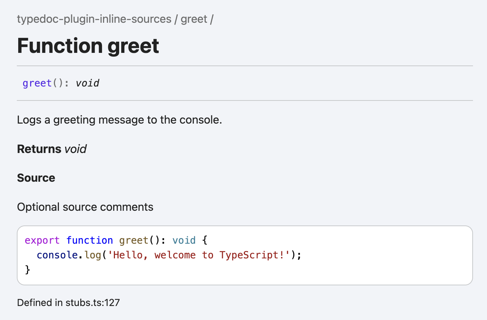

# typedoc-plugin-inline-sources

A plugin for [TypeDoc](https://github.com/TypeStrong/typedoc) that inlines source code into documentation.

[](https://www.npmjs.com/package/typedoc-plugin-inline-sources) [](https://github.com/tgreyuk/typedoc-plugin-inline-sources/actions/workflows/ci.yml)

## Contents

- [Overview](#overview)
- [Installation](#installation)
- [Usage](#usage)
- [Documentation](#documentation)
  - [`@source` Tag](#source-tag)
  - [Displaying an alternative title](#displaying-an-alternative-title)
  - [Handling "unknown block tag" warning](#handling-unknown-block-tag-warning)
- [License](#license)

## Overview

By default, when you generate documentation using TypeDoc, it includes a "Defined in" section at the bottom of each symbol, linking to the relevant line in the source file.

This plugin can be used if you additionally require the symbols source code to be included in the generated documentation.

## Installation

```bash
npm install --save-dev typedoc-plugin-inline-sources
```

## Usage

Simply add the plugin to your `typedoc.json` or equivalent config file.

```json
{
  "plugin": ["typedoc-plugin-inline-sources"]
}
```

## Documentation

### `@source` Tag

The **`@source`** tag is a custom documentation tag used to include the source code directly within the generated output documentation. This is particularly useful where you not only want to describe the functionality of a symbol but also display the actual code for reference.

Here’s an example of a function with the @source tag included:

#### Typescript

```ts
/**
 * Logs a greeting message to the console.
 *
 * @source Optional source comments
 */
export function greet(): void {
  console.log('Hello, welcome to TypeScript!');
}
```

#### Output



### Displaying an alternative title

Block tags are output as "title case" headings in the final output. If you would like an alternative heading to "Source" you can replace locale entry for the tag:

```json
"locales": {
    "en": {
      "tag_source": "My Source Code"
    }
  }
```

### Handling "unknown block tag" warning

When using the tag, TypeDoc (since 0.26) will generate the following warning:

```shell
[warning] Encountered an unknown block tag @source
```

To suppress this warning you have two options.

#### 1. Using the `--blockTags` TypeDoc option:

You can extend the tag defaults by using a JavaScript configuration file:

```ts
import { OptionDefaults } from 'typedoc';

const config = {
  blockTags: [...OptionDefaults.blockTags, '@source'],
};
```

See https://typedoc.org/options/comments/#blocktags.

#### 2. Adding a `tsdoc.json` file:

You add a `tsdoc.json` file next to your `tsconfig.json` file and include the `@source` tag name.

```json
{
  "$schema": "https://developer.microsoft.com/en-us/json-schemas/tsdoc/v0/tsdoc.schema.json",
  "extends": ["typedoc/tsdoc.json"],
  "tagDefinitions": [
    {
      "tagName": "@source",
      "syntaxKind": "block"
    }
  ]
}
```

See https://typedoc.org/options/configuration/#tsconfig.

## License

MIT
